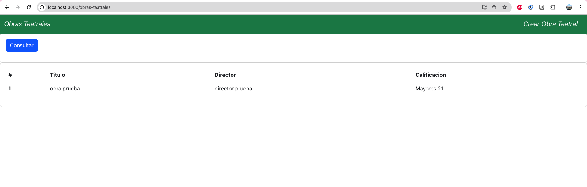
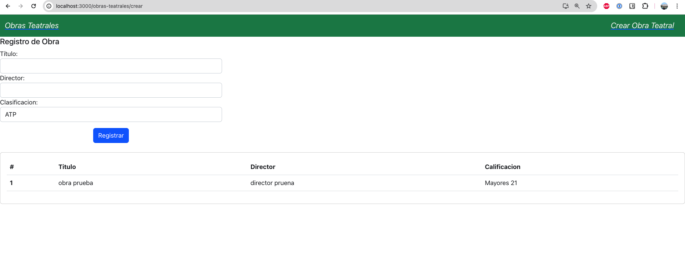

# Consideraciones sobre el simulacro Parcial 2:
Midan sus tiempos ⌛ ⏳

## Antes de arranca
Copien el contenido en sus portafolios. Recuerden no copiar la carpeta oculta `.git`


## Colección de Postman
> Recuerden que esto también lo pueden ver desde las `dev tools` del navegador

Link para importar al postman: https://api.postman.com/collections/1880332-dd78c890-199a-4cf1-bd8d-e6ee469b4c74?access_key=PMAT-01JBE11R426B6ND39BVQJQM6Q0

## Simulacro
> Los de las imagenes sonde ejemplo. Pueden usar el estilo y base de proyecto que deseen. Dejo [aquí](https://labsys.frc.utn.edu.ar/gitlab/desarrollo-de-software1/materiales/ejercicios/react-integracion-con-back-cine/-/tree/en-clases?ref_type=heads) un ejemplo visto
1. Crear frontend
3. Crear NavBar o Menu con Cosultar y registrar.
4. Consultar Conductores. Por ejemplo
 
5. Crear un conductor, tambien debe tener la tabla de consulta. Por ejemplo
 
6. Editar conductor 
7. Borrar conductor


## Opcional
2. Si quieren usar bootstrap puede agregar en las depencias: `"react-bootstrap": ...`


## Solución propuesta:
La van a encontrar en este mismo repo, en la rama `guia`. Acá usé rreact-bootstrap

## Documentacion guía:
- Bootstrap-react: https://react-bootstrap.netlify.app/docs/components/accordion
- React: https://react.dev/reference/react/useEffect
- React router: https://reactrouter.com/en/main/hooks/use-navigate

> Google, stackoverflow y chat GPT (lean y busquen comprender, cualquier cosa pregunten)

## Configuraciones de ayuda general:
https://labsys.frc.utn.edu.ar/gitlab/desarrollo-de-software1/materiales/configuraciones-de-ayuda


## Sentencias SQL de la tabla Clasificiones 
Solo en el caso que se les borre los datos.
```sql
INSERT INTO Clasificaciones
(Titulo, Descripcion)
VALUES('F1', 'Fórmula 1');
INSERT INTO Clasificaciones
(Titulo, Descripcion)
VALUES('F2', 'Fórmula 2');
INSERT INTO Clasificaciones
(Titulo, Descripcion)
VALUES('Junior', 'Menores 13');
```