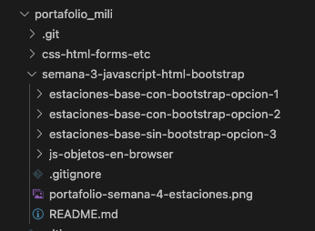

# Semana 4 - Javascript - objetos - HTML
- Objetos Javascript.
- Integración de HTML y JS
- DOM: manejo de documento con JavaScript. Interfaces y objetos. 

## Material
### Presentaciones
1. Boststrap [aquí](https://docs.google.com/presentation/d/1HavLAukEtUW6vJLvy9ynjOsZTQKZKOEuIEzPiYy7ZpI/edit?usp=drive_link)
2. Javascript - objetos - HTML [aquí](https://docs.google.com/presentation/d/1mmXo4_0uNU63o4dL53DWOMCqf6GoTjFUOONtJsbaGv4/edit?usp=sharing)

### Repositorio material extra
- HTML y Bootstrap[aquí](https://labsys.frc.utn.edu.ar/gitlab/desarrollo-de-software1/materiales/semana-03)
- Javascript [aquí](https://labsys.frc.utn.edu.ar/gitlab/desarrollo-de-software1/materiales/semana-04)

### Portafolio profe Mili
- [aquí](https://labsys.frc.utn.edu.ar/gitlab/desarrollo-de-software1/proyectos2024/3k1a/portafolio_mili)

## Qué vamos a hacer hoy en clases?
En la rama `main` y carpta [js-objetos-en-browser](./js-objetos-en-browser/) contiene los archivo bases HTML y CSS (bootstrap). Vamos a agregarle items a la tabla de superheroes con Javascript y darle funcionalidad al botón filtrar.

En la rama `guía` se muestra una solucion propuesta.

## Desafíos
### 1. Desafío para continuar con superheroes.html - Ejercitación
A partir de la rama `guía` realizar:

1. Limpiar la grilla cuando se presiona el boton filtrar, antes de mostrar los filtrados. Como ayudan pueden poner primero un boton de limpiar en [js-objetos-en-browser](./js-objetos-en-browser/).

### 2. Desafío para continuar con estaciones, opción 1 o 2 - Ejercitación
1. Agregar el comportamiento de listar estaciones y fltrar estaciones en el HTML que veniamos trabajado. En las carpetas [estaciones-base-con-bootstrap-opcion-1](./estaciones-base-con-bootstrap-opcion-1/) y [estaciones-base-con-bootstrap-opcion-2](./estaciones-base-con-bootstrap-opcion-2/) hay archivos base (HTML y CSS) para poder usarlos si es que no tienen el propio. En su portafolio tienen que agregar una nueva carpeta para realizar esto, como se ven la imagen

    

### 3. Desafío para continuar con estaciones, opción 3 - Ejercitación solo boostrap
1. Agregarle estilo con bootstrap a [estaciones-base-sin-bootstrap-opcion-3](./estaciones-base-sin-bootstrap-opcion-3/)

> Todo tiene que quedar en su portafolio.

## Link útiles
- Bootstrap: https://getbootstrap.com/docs/5.0/getting-started/introduction/
- Métodos de array Javascript: https://developer.mozilla.org/es/docs/Web/JavaScript/Reference/Global_Objects/Array/map 
